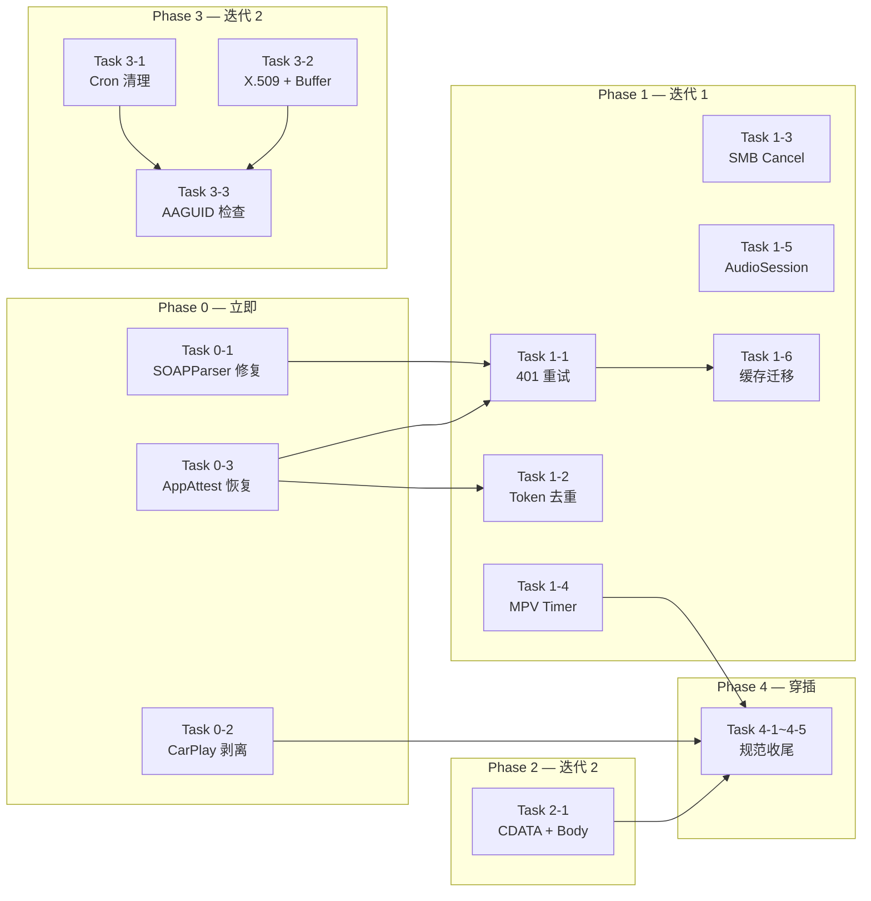

# Mivu 代码审计修复计划 (Code Audit Fix Plan)

**制定日期**：2026-09-15  
**关联文档**：[`CODE_AUDIT_REPORT.md`](file:///Users/kelvinsze/Projects/Mivu/docs/CODE_AUDIT_REPORT.md)  
**修复范围**：审计报告中全部 3 项 P0 + 14 项 P1 + 10 项 P2 共 27 项待修复条目

---

## 执行原则

1. **P0 立即修复**：阻断单测失败、审核驳回和功能永久瘫痪，合入前必须通过对应单测。
2. **P1 按迭代推进**：每个迭代聚焦一个子系统，确保变更可独立验证。
3. **P2 择机收纳**：低风险改进项在对应文件发生修改时顺带完成，不单独排期。
4. **每项修复均需附带验证手段**：单元测试、手动测试步骤或日志断言。

---

## Phase 0 — 紧急修复（阻断性缺陷）

> 目标：消除单测失败、App Store 审核风险和评分功能永久瘫痪。在当前开发分支即刻完成。

### Task 0-1: 修复 SOAPParser DIDL-Lite 标题解析（P0-1）

| 项目 | 详情 |
|:---|:---|
| **文件** | [`Sources/Receiver/SOAPParser.swift`](file:///Users/kelvinsze/Projects/Mivu/Sources/Receiver/SOAPParser.swift) |
| **改动** | 在 `extractTitleFromDIDLLite` 方法中，正则匹配前先对 `didlString` 调用 `unescapeXML` |
| **顺带 P2** | 🟢 P2-3: 在 `unescapeXML` 中增加 `&#(\d+);` 和 `&#x([0-9a-fA-F]+);` 数字实体解码 |

```swift
// 修复后的方法
public static func extractTitleFromDIDLLite(_ didlString: String) -> String? {
    guard !didlString.isEmpty else { return nil }
    let unescaped = unescapeXML(didlString)                    // ← 新增
    let pattern = "<dc:title[^>]*>(.*?)</dc:title>"
    if let regex = try? NSRegularExpression(pattern: pattern, options: [.caseInsensitive, .dotMatchesLineSeparators]),
       let match = regex.firstMatch(in: unescaped, options: [], range: NSRange(location: 0, length: unescaped.utf16.count)),
       let titleRange = Range(match.range(at: 1), in: unescaped) {
        let rawTitle = String(unescaped[titleRange])
        return unescapeXML(rawTitle).trimmingCharacters(in: .whitespacesAndNewlines)
    }
    return nil
}
```

**验证**：
```bash
xcodebuild test -scheme Mivu -only-testing MivuTests/SOAPParserTests/testExtractTitleFromDIDLLite
```

---

### Task 0-2: 剥离 CarPlay 手机视图挂载（P0-2）

三处联动修改，缺一不可：

| # | 文件 | 改动 |
|:---|:---|:---|
| A | [`Sources/Application/PhoneSceneDelegate.swift`](file:///Users/kelvinsze/Projects/Mivu/Sources/Application/PhoneSceneDelegate.swift) | 删除 `carPlayWindow` 属性；删除 `scene(_:willConnectTo:options:)` 中 `UIWindowSceneSessionRoleCarPlay` 整个 `if` 分支 |
| B | [`Sources/Application/MivuApp.swift`](file:///Users/kelvinsze/Projects/Mivu/Sources/Application/MivuApp.swift) | 在 `AppDelegate.application(_:configurationForConnecting:options:)` 中删除 `else if sceneRole.rawValue == "UIWindowSceneSessionRoleCarPlay"` 整个分支 |
| C | [`Sources/Info.plist`](file:///Users/kelvinsze/Projects/Mivu/Sources/Info.plist) | 删除 `UIWindowSceneSessionRoleCarPlay` 整个键及其子字典（约第 79-89 行） |

**修复后 PhoneSceneDelegate 应仅保留**：
```swift
public final class PhoneSceneDelegate: UIResponder, UIWindowSceneDelegate {
    public func scene(_ scene: UIScene, willConnectTo session: UISceneSession, options connectionOptions: UIScene.ConnectionOptions) {
        if let url = connectionOptions.urlContexts.first?.url {
            handleIncomingURL(url)
        }
    }
    // ... openURLContexts / handleIncomingURL 保持不变
}
```

**修复后 AppDelegate 场景路由应仅保留两条分支**：
```swift
if isCarPlayScene {
    // → CarPlaySceneDelegate (CPTemplateApplicationScene)
} else {
    // → PhoneSceneDelegate (UIWindowScene)
}
```

**验证**：
- CarPlay Simulator 中确认连接后显示 `CPListTemplate` 根模板（非手机 MainTabView）。
- 手机端确认 deep link (`mivu://play?url=...`) 正常触发播放。

---

### Task 0-3: 修复 AppAttestClient 设备恢复永久失效（P0-3）

| 项目 | 详情 |
|:---|:---|
| **文件** | [`Sources/MediaCore/AppAttestClient.swift`](file:///Users/kelvinsze/Projects/Mivu/Sources/MediaCore/AppAttestClient.swift) |
| **改动** | 1. 在 `sessionToken` 的 `catch` 中检测 `DCError`，若为 key 不可用则清除全部缓存并重试一次；2. 暴露 `public func resetAllAttestation()` 清除 `keyIDKey`/`tokenKey`/`tokenExpiryKey` |

```swift
public func sessionToken(baseURL: URL) async -> String? {
    // ... 现有缓存检查 ...
    do {
        let keyID = try await ensureKeyID(baseURL: baseURL)
        // ... 现有 challenge → assertion → post 流程 ...
    } catch {
        // 新增：如果是 Secure Enclave key 不可达，清除陈旧 keyID 后重试一次
        if isKeyUnavailableError(error) {
            resetAllAttestation()
            return try? await retryFreshAttestation(baseURL: baseURL)
        }
        return nil
    }
}

public func invalidateSessionToken() {
    UserDefaults.standard.removeObject(forKey: tokenKey)
    UserDefaults.standard.removeObject(forKey: tokenExpiryKey)
}

public func resetAllAttestation() {
    UserDefaults.standard.removeObject(forKey: keyIDKey)
    invalidateSessionToken()
}

private func isKeyUnavailableError(_ error: Error) -> Bool {
    let nsError = error as NSError
    // DCError.invalidKey / DCError.unknownSystemFailure / SecKey errors
    return nsError.domain == "com.apple.devicecheck.error"
        || nsError.domain == NSOSStatusErrorDomain
}
```

**验证**：
- 在真机上删除 Keychain 中的 App Attest key（或使用 `resetAllAttestation`），确认能自动重新注册并恢复评分功能。

---

## Phase 1 — 客户端并发与资源管理

> 目标：修复评分客户端的 token 管理、SMB 资源泄漏、MPV 能耗和音频会话问题。

### Task 1-1: 评分 Token 401 自动失效与重试（P1-1）

| 项目 | 详情 |
|:---|:---|
| **文件** | [`Sources/MediaCore/UnifiedRatingsAPIClient.swift`](file:///Users/kelvinsze/Projects/Mivu/Sources/MediaCore/UnifiedRatingsAPIClient.swift) |
| **改动** | 拆分 HTTP 响应处理，检测 401 时调用 `AppAttestClient.shared.invalidateSessionToken()` 并重试一次 |

```swift
// 替换现有的 guard let (data, response) = try? await ... else { return nil }
let (data, response) = try await URLSession.shared.data(for: request)
guard let httpResponse = response as? HTTPURLResponse else { return nil }

if httpResponse.statusCode == 401 {
    // Token 已失效，清除缓存并重试一次
    await AppAttestClient.shared.invalidateSessionToken()
    guard let newToken = await AppAttestClient.shared.sessionToken(baseURL: endpoint) else { return nil }
    request.setValue("Bearer \(newToken)", forHTTPHeaderField: "Authorization")
    let (retryData, retryResponse) = try await URLSession.shared.data(for: request)
    guard let retryHTTP = retryResponse as? HTTPURLResponse,
          (200...299).contains(retryHTTP.statusCode),
          let ratings = try? JSONDecoder().decode(Response.self, from: retryData) else { return nil }
    cache(ratings, for: lookup)
    return ratings.applying(to: item)
}

guard (200...299).contains(httpResponse.statusCode),
      let ratings = try? JSONDecoder().decode(Response.self, from: data) else { return nil }
```

**顺带 P2**：在 `else` 分支添加 `os_log` 记录非 200 状态码和 error body。

---

### Task 1-2: AppAttestClient 并发 Token 刷新去重（P1-2）

| 项目 | 详情 |
|:---|:---|
| **文件** | [`Sources/MediaCore/AppAttestClient.swift`](file:///Users/kelvinsze/Projects/Mivu/Sources/MediaCore/AppAttestClient.swift) |
| **改动** | 新增 `private var inFlightRefresh: Task<String?, Never>?`，在 `sessionToken` 中合并并发请求 |

```swift
private var inFlightRefresh: Task<String?, Never>?

public func sessionToken(baseURL: URL) async -> String? {
    // 1. 缓存命中快速返回
    if let cached = cachedToken() { return cached }

    // 2. 如果已有进行中的刷新，等待其结果
    if let existing = inFlightRefresh {
        return await existing.value
    }

    // 3. 发起新的刷新任务
    let task = Task<String?, Never> { [weak self] in
        defer { self?.inFlightRefresh = nil }
        return await self?.performTokenRefresh(baseURL: baseURL)
    }
    inFlightRefresh = task
    return await task.value
}
```

---

### Task 1-3: SMB 加载请求支持显式 Cancel（P1-3）

| 项目 | 详情 |
|:---|:---|
| **文件** | [`Sources/MediaCore/PlaybackCore/SMBAssetResourceLoader.swift`](file:///Users/kelvinsze/Projects/Mivu/Sources/MediaCore/PlaybackCore/SMBAssetResourceLoader.swift) |
| **改动** | 新增 `activeTasks` 字典管理 Task 句柄；`didCancel` 中取消对应 Task；读取循环内检查 `Task.isCancelled` |

```swift
private var activeTasks: [AVAssetResourceLoadingRequest: Task<Void, Never>] = [:]

func resourceLoader(_ resourceLoader: AVAssetResourceLoader,
                    shouldWaitForLoadingOfRequestedResource loadingRequest: AVAssetResourceLoadingRequest) -> Bool {
    let task = Task { [reader, weak self] in
        defer { self?.queue.async { self?.activeTasks.removeValue(forKey: loadingRequest) } }
        do {
            // ... metadata + content info（保持不变） ...
            if let dataRequest = loadingRequest.dataRequest {
                var offset = UInt64(max(dataRequest.currentOffset, dataRequest.requestedOffset))
                var remaining = dataRequest.requestedLength
                while remaining > 0, offset < metadata.length {
                    guard !Task.isCancelled, !loadingRequest.isCancelled else { return }  // ← 新增
                    let count = min(remaining, 512 * 1024)
                    let chunk = try await reader.read(offset: offset, length: UInt32(count))
                    guard !chunk.isEmpty else { break }
                    guard !Task.isCancelled, !loadingRequest.isCancelled else { return }  // ← 新增
                    dataRequest.respond(with: chunk)
                    offset += UInt64(chunk.count)
                    remaining -= chunk.count
                }
            }
            guard !loadingRequest.isCancelled else { return }  // ← 新增
            loadingRequest.finishLoading()
        } catch {
            guard !loadingRequest.isCancelled else { return }  // ← 新增
            loadingRequest.finishLoading(with: error)
        }
    }
    activeTasks[loadingRequest] = task
    return true
}

func resourceLoader(_ resourceLoader: AVAssetResourceLoader,
                    didCancel loadingRequest: AVAssetResourceLoadingRequest) {
    activeTasks.removeValue(forKey: loadingRequest)?.cancel()   // ← 新增
}
```

---

### Task 1-4: MPV 暂停时停止渲染定时器（P1-5）+ 去高频 Task（P2-1）

| 项目 | 详情 |
|:---|:---|
| **文件** | [`Sources/MediaCore/PlaybackCore/MPVPlayerEngine.swift`](file:///Users/kelvinsze/Projects/Mivu/Sources/MediaCore/PlaybackCore/MPVPlayerEngine.swift) |
| **改动** | 1. `pause()` 中调用 `stopRenderTimer()`；2. 将帧计数改为 `renderQueue` 本地维护，仅首帧通知 `@MainActor` |

```swift
public func pause() {
    guard isOperational else { return }
    stopRenderTimer()                                           // ← 新增
    let handle = MPVControlHandle(handle)
    controlQueue.async { _ = mivuMPVSetPaused(handle.rawValue, 1) }
    updateSnapshot { $0.status = .paused }
}

public func play() {
    guard isOperational else { return }
    startRenderTimer()                                          // ← 已有但确保恢复
    let handle = MPVControlHandle(handle)
    controlQueue.async { _ = mivuMPVSetPaused(handle.rawValue, 0) }
    updateSnapshot { $0.status = .playing; $0.errorMessage = nil }
}

// startRenderTimer 内的 eventHandler 优化：
timer.setEventHandler { [weak self] in
    guard let rawHandle = mpvHandle.rawValue else { return }
    if let unmanaged = mivuMPVRenderSampleBuffer(rawHandle, 0, 0) {
        let sampleBuffer = unmanaged.takeRetainedValue()
        target.enqueue(sampleBuffer)
        let count = OSAtomicIncrement32(&self!.atomicFrameCount)
        // 仅在关键里程碑通知主线程
        if [1, 30, 90, 150].contains(Int(count)) {
            Task { @MainActor [weak self] in
                self?.onFrameRendered()
            }
        }
    }
}
```

---

### Task 1-5: AVAudioSession 停用 + 异步激活（P1-6 + P2-2）

| 项目 | 详情 |
|:---|:---|
| **文件** | [`Sources/MediaCore/PlayerService.swift`](file:///Users/kelvinsze/Projects/Mivu/Sources/MediaCore/PlayerService.swift) |
| **改动** | 1. `setupAudioSession` 改用 `Task.detached`；2. 在 `stop()` 或 session 结束时调用 `deactivateAudioSession` |

```swift
private func setupAudioSession() {
    Task.detached(priority: .userInitiated) {
        do {
            let session = AVAudioSession.sharedInstance()
            try session.setCategory(.playback, mode: .moviePlayback)
            try session.setActive(true)
        } catch {
            try? AVAudioSession.sharedInstance().setCategory(.playback)
            try? AVAudioSession.sharedInstance().setActive(true)
        }
    }
}

private func deactivateAudioSession() {
    Task.detached(priority: .utility) {
        try? AVAudioSession.sharedInstance().setActive(false, options: .notifyOthersOnDeactivation)
    }
}
```

在 `stop()` 末尾追加 `deactivateAudioSession()` 调用。

---

### Task 1-6: 评分缓存迁出 UserDefaults（P1-7）

| 项目 | 详情 |
|:---|:---|
| **文件** | [`Sources/MediaCore/UnifiedRatingsAPIClient.swift`](file:///Users/kelvinsze/Projects/Mivu/Sources/MediaCore/UnifiedRatingsAPIClient.swift) |
| **改动** | 将 `cachedResponse` / `cache` 方法的存储后端从 `UserDefaults` 改为 `NSCache<NSString, CacheEntry>` |

```swift
private static let memoryCache: NSCache<NSString, CacheBox> = {
    let cache = NSCache<NSString, CacheBox>()
    cache.countLimit = 500
    return cache
}()

private final class CacheBox: NSObject {
    let entry: CacheEntry
    init(_ entry: CacheEntry) { self.entry = entry }
}

private static func cachedResponse(for lookup: Lookup) -> Response? {
    guard let box = memoryCache.object(forKey: lookup.cacheKey as NSString),
          box.entry.expiresAt > Date() else { return nil }
    return box.entry.response
}

private static func cache(_ response: Response, for lookup: Lookup) {
    let entry = CacheEntry(response: response, expiresAt: Date().addingTimeInterval(cacheTTL))
    memoryCache.setObject(CacheBox(entry), forKey: lookup.cacheKey as NSString)
}
```

---

## Phase 2 — 投屏兼容性强化

> 目标：提升 DLNA/UPnP 投屏对第三方客户端的兼容性。

### Task 2-1: SOAPXMLHelper 实现 CDATA 委托（P1-4）+ action 捕获优化（P2-4）

| 项目 | 详情 |
|:---|:---|
| **文件** | [`Sources/Receiver/SOAPParser.swift`](file:///Users/kelvinsze/Projects/Mivu/Sources/Receiver/SOAPParser.swift) |
| **改动** | 1. 在 `SOAPXMLHelper` 中实现 `parser(_:foundCDATA:)`；2. 维护 `parentElements` 栈，仅在父元素为 `Body` 时捕获 `actionName` |

```swift
// 新增 CDATA 支持
func parser(_ parser: XMLParser, foundCDATA CDATABlock: Data) {
    if let string = String(data: CDATABlock, encoding: .utf8) {
        currentValue += string
    }
}

// 修改 action name 捕获逻辑
private var parentElements: [String] = []

func parser(_ parser: XMLParser, didStartElement elementName: String, ...) {
    depth += 1
    let strippedParent = parentElements.last?.components(separatedBy: ":").last ?? ""
    parentElements.append(elementName)
    currentElement = elementName
    currentValue = ""

    let strippedName = elementName.components(separatedBy: ":").last ?? elementName
    if depth == 3 && actionName.isEmpty && strippedParent == "Body"    // ← 改进
       && strippedName != "Body" && strippedName != "Envelope" {
        actionName = strippedName
        actionDepth = depth
    }
}

func parser(_ parser: XMLParser, didEndElement elementName: String, ...) {
    // ... existing logic ...
    parentElements.removeLast()
    depth -= 1
}
```

**验证**：新增单测用例覆盖 CDATA 包裹的 DIDL-Lite 元数据和含 `<s:Header>` 的 SOAP 请求。

---

## Phase 3 — 云端安全加固

> 目标：修复 ratings-api 中的安全验证缺口和运维问题。

### Task 3-1: 挑战码过期清理（P1-8）

| # | 文件 | 改动 |
|:---|:---|:---|
| A | `ratings-api/migrations/0004_challenge_index.sql`（新建） | `CREATE INDEX IF NOT EXISTS idx_challenges_expires ON app_attest_challenges(expires_at);` |
| B | [`ratings-api/wrangler.toml`](file:///Users/kelvinsze/Projects/Mivu/ratings-api/wrangler.toml) | 添加 `[triggers]` 段：`crons = ["0 * * * *"]` |
| C | [`ratings-api/src/index.ts`](file:///Users/kelvinsze/Projects/Mivu/ratings-api/src/index.ts) | 导出 `scheduled` handler：`DELETE FROM app_attest_challenges WHERE expires_at < unixepoch()` |

### Task 3-2: X.509 证书有效期验证（P1-9）+ Buffer View 修复（P1-10）

| 项目 | 详情 |
|:---|:---|
| **文件** | [`ratings-api/src/app-attest/attestation.ts`](file:///Users/kelvinsze/Projects/Mivu/ratings-api/src/app-attest/attestation.ts) |

```typescript
// 1. 在 validateChain 中添加日期检查
async function validateChain(x5c: Uint8Array[]): Promise<X509Certificate> {
    // ... existing chain build ...
    const now = new Date();
    for (const cert of chain) {
        if (now < cert.notBefore || now > cert.notAfter) {
            throw new Error(`Certificate expired or not yet valid: ${cert.subject}`);
        }
    }
    // ... existing root comparison ...
}

// 2. 修复 sha256 中的 buffer view 陷阱
async function sha256(data: Uint8Array): Promise<Uint8Array> {
    const buf = data.buffer.slice(data.byteOffset, data.byteOffset + data.byteLength);
    return new Uint8Array(await crypto.subtle.digest('SHA-256', buf));
}

// 3. 修复 validateChain 中的 x5c 映射
const certs = x5c.map(der => {
    const buf = der.buffer.slice(der.byteOffset, der.byteOffset + der.byteLength);
    return new X509Certificate(buf);
});
```

### Task 3-3: 生产环境拒绝 Development AAGUID（P1-11）

| 项目 | 详情 |
|:---|:---|
| **文件** | [`ratings-api/src/routes/app-attest.ts`](file:///Users/kelvinsze/Projects/Mivu/ratings-api/src/routes/app-attest.ts) |
| **改动** | 在 `/v1/app-attest/attest` 路由的 `verifyAttestation` 成功后添加环境检查 |

```typescript
const result = await verifyAttestation(body.attestation, body.keyId, challenge, ids.team, ids.bundle);

// 生产环境不接受开发认证
if (c.env.ENVIRONMENT === 'production' && result.env === 'dev') {
    return createErrorResponse('FORBIDDEN', 'Development attestations are not permitted in production', 403);
}
```

**验证**：用开发签名的 App 向生产 API 发起 attest 请求，确认返回 403。

---

## Phase 4 — 工程规范与合规收尾

> 目标：清理配置不一致和合规风险。可在任意迭代中穿插完成。

| Task | 改动 | 文件 |
|:---|:---|:---|
| 4-1 Logger 统一 (P2-5) | 将 `"com.kelvinsze.mivu"` 全部替换为 `"com.kold.mivu"` | `PhoneSceneDelegate.swift`、`MivuApp.swift` 等 |
| 4-2 ATS 收窄 (P2-6) | 将 `NSAllowsArbitraryLoads` 改为 `NSAllowsLocalNetworking: true`；为 `mivu-rating-api.koldllc.com` 配置 HTTPS 域名例外 | [`Info.plist`](file:///Users/kelvinsze/Projects/Mivu/Sources/Info.plist) |
| 4-3 Entitlements 去重 (P2-7) | 移除 `project.yml` 中 `entitlements.properties` 块，仅保留 `path: Mivu.entitlements` | [`project.yml`](file:///Users/kelvinsze/Projects/Mivu/project.yml) |
| 4-4 CORS 收窄 (P2-7) | 为 `/v1/admin/*` 路由单独设置 CORS 白名单 | `ratings-api/src/index.ts` |
| 4-5 App Attest 环境 | 发布前将 `Mivu.entitlements` 和 `project.yml` 中的 `development` 切换为 `production` | [`Mivu.entitlements`](file:///Users/kelvinsze/Projects/Mivu/Mivu.entitlements)、[`project.yml`](file:///Users/kelvinsze/Projects/Mivu/project.yml) |

---

## 执行时序总览



---

## 完成标准

| Phase | 验收条件 |
|:---|:---|
| Phase 0 | `MivuTests` 全部通过；CarPlay Simulator 正常显示 CPListTemplate；真机删 Keychain 后评分自动恢复 |
| Phase 1 | 401 场景下评分自动恢复；SMB seek 无延迟；暂停状态 CPU 占用 < 5%；其他音频 App 恢复正常 |
| Phase 2 | 爱奇艺/B站投送标题正确显示；含 Header 的 SOAP 请求正确解析 |
| Phase 3 | D1 挑战码表自动清理；过期证书被拒；开发 AAGUID 在生产被 403 |
| Phase 4 | Console 日志按 `com.kold.mivu` 可检索；ATS 仅放行局域网；Entitlements 单源维护 |
